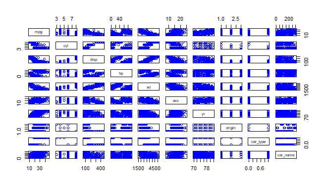
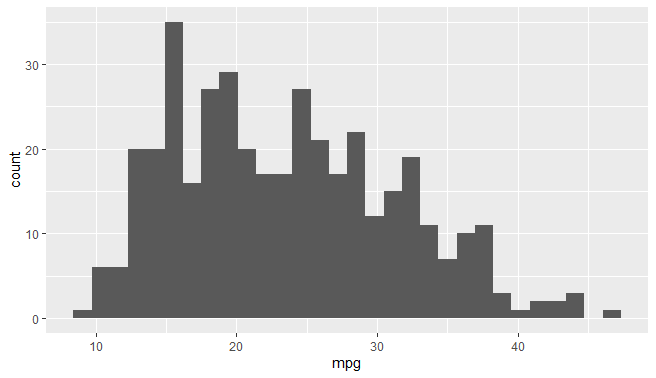

# linear_regressionmodel of car mpg varying with various factor like acc hp etc

1.plot of data in car.csv with various factor  

2.density plot of car mpg with respect to hp of car dataset 

3.histogram plot of car mpg with respect to car acc 

4.histogram plot of car mpg with resprct to car wt 

5.plot of car mpg with all factors add up in single histogram plot 
